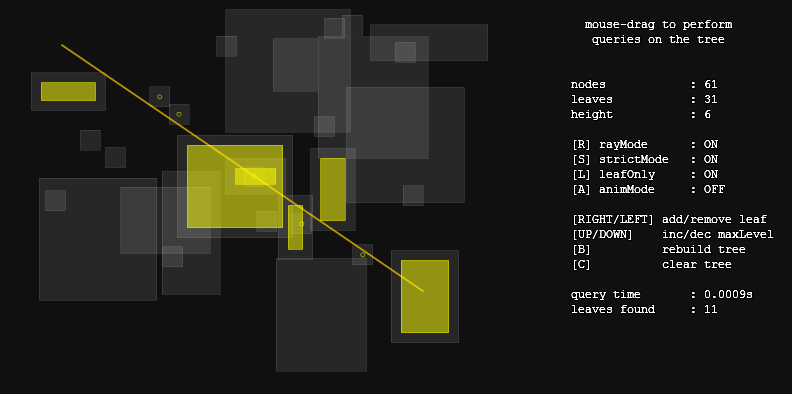

AABBTree
========

Haxe dynamic [AABB tree](http://en.wikipedia.org/wiki/Bounding_volume_hierarchy) for fast spatial partitioning and query.

 - fast insertion/removal/update
 - supports both AABB and raycast type of queries
 - easy to use and highly customizable
 - no dependencies

Check the [demo](https://dl.dropboxusercontent.com/u/32864004/dev/FPDemo/AABBTreeTest00.swf):

Take a look at [AABBTreeTest.hx](src/AABBTreeTest.hx) to see how to use it.

###CREDITS
The code is heavily inspired by the implementations of a dynamic AABB tree by 

 - Nathanael Presson 	(Bullet Physics - [http://bulletphysics.org](http://bulletphysics.org))
 - Erin Catto 			(Box2D - [http://www.box2d.org](http://www.box2d.org))

###LICENSE
This lib is developed by Giuseppe Di Mauro (azrafe7) and released under the MIT license. See the LICENSE file for details.
